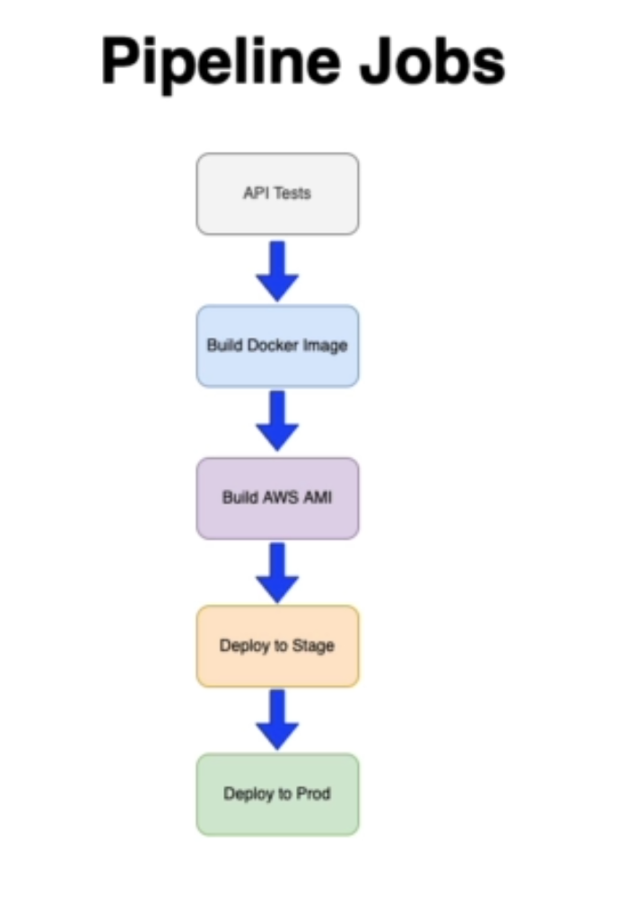
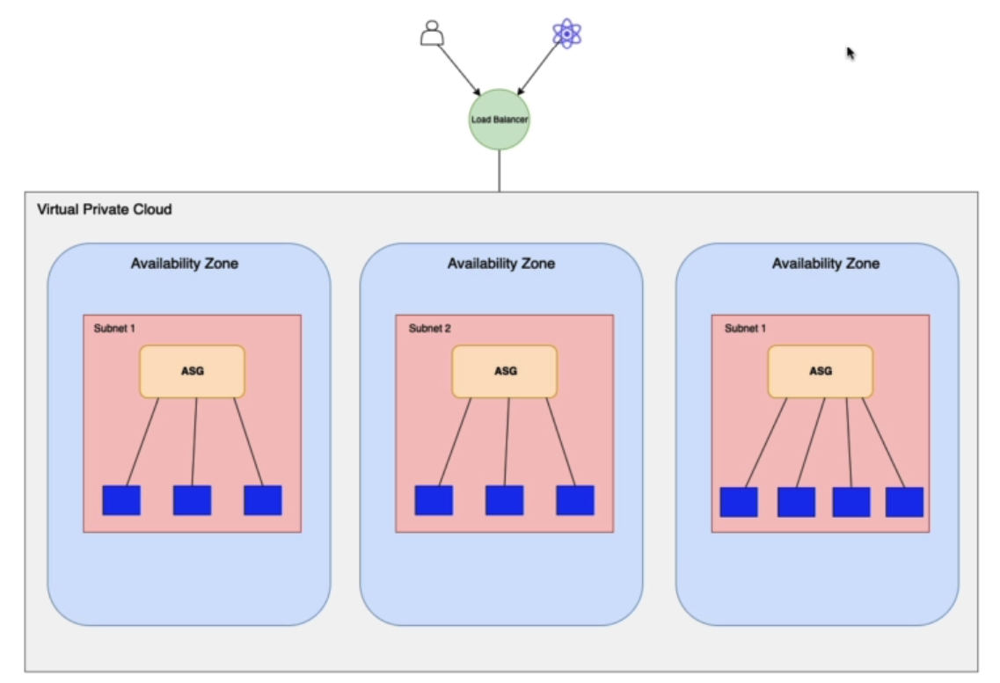

# Nomad E-commerce store API

This repo contains the Nomad E-commerce store API server project files.

## Cloning API files
- We clone the api repo we will be using: `git clone git@github.com:cagarweyne/devops-masterclass-api-starter.git nomad-store-api`
- Adding content to the `ci.yml` file for the continuous integration, specifying the AWS access key and password, also defining the region
- In order to push changes to github we need to create a new repo in github (make it public to have available the Environments features)
- Since we are having 2 environments we need to into github in the browser > settings > Environments > New Environment: `nomad-stage` and `nomad-prod` for this one we also need **required reviewers**
- Lets add secrets for the `nomad-stage` environment: GitHub > Settings > Environments > `nomad-stage` > Environment secrets
```
   AWS_ACCESS_KEY_ID
   AWS_SECRET_ACCESS_KEY
   AWS_DEFAULT_REGION
```
- Configuring how to trigger a build, making changes to the `ci.yml` file
- We will have the following Pipeline Jobs:

- For the API test stage we are going to run the script in `calculate.js` using `mocha` that is defined in the `package.json` file as an script.
- The next stage is to build our docker image and push it to DockerHub
- The third stage will be to build a AWS AMI from ubuntu base image using `Packer`
- The next stage is to Deploy to Stage, executing a set of terraform commands/config inside of the terraform folder taking the AWS AMI created in previous stage
- Once everything was fine to Stage the next stage is to deploy to PRODUCTION

## API Test Job
- We modify the ci.yml file to add the test job to test the apis 
- We are using some Actions from Github to speed things up for our CI 
- Once we push the changes to github it will trigger the build, move to github and go to Actions you will see the steps that it took to execute the job.

## Build docker Image Job
- Adding the job in the `ci.yml` file for the build docker image stage

## Build AWS AMI Job
- Adding the job to build the AWS AMI job using Packer which will use docker image from dockerhub

## Now we need to provision some resources for the following architecture

- The the consumers of our API would be a user or a react app, that would be accessing this particular API, so the way they access that is going to be via a load balancer that sits in front of the users and any applications that are going to be accessing this particular API. And the load balancer will be replicated in each availability zone, so for that we are going to create our own VPC (previously we used the default VPC.) and we'll be deploying subnets in each availability zone and within each subnet we're going to have the automated scaling group and then we're going to have each EC2 instance that is going to be running. So this basically refers to the PRODUCTION setup that means at most we're going to have ten EC2 instances that are going to be serving the requests that are going to be coming in from the load balancer. 


Doc Reference: https://docs.github.com/en/actions/using-workflows/workflow-syntax-for-github-actions 